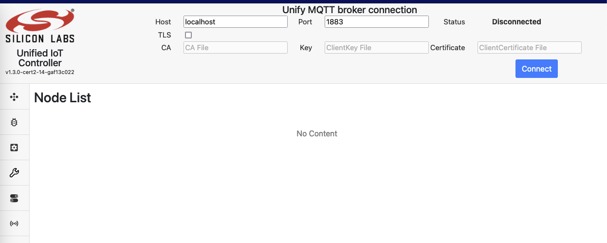
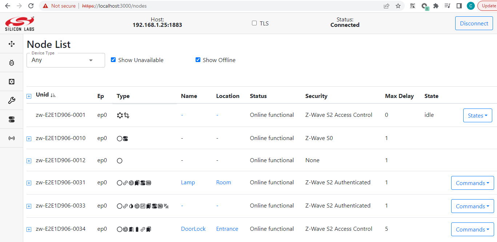
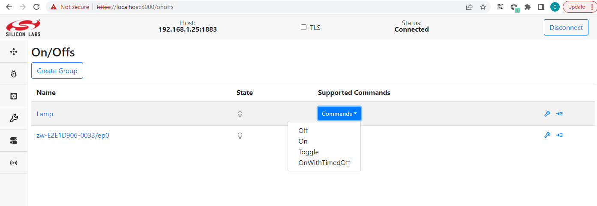
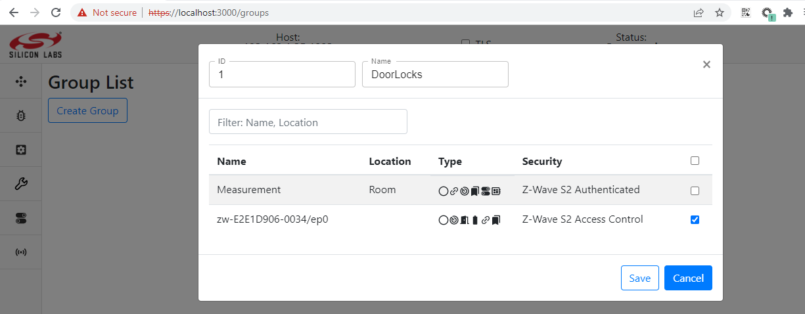

# Dev GUI User's Guide

The _Unify SDK Developer GUI_ is a Web service that runs on the
_UIC_ gateway. It provides a graphical interface to operate the various features
of the _UIC_ gateway, such as network management, smartstart, multicast, and so on.

## Access Developer GUI

The developer GUI (_Dev GUI_) can be accessed via any browser that can
reach the _UIC_ gateway over TCP/IP. Enter the hostname or IP address of
the target running _UIC_ and port 3000, which is the default port for _Dev GUI_.
This process is shown in the image below where the hostname of a Raspberry is
raspberrypi.local:

> In addition to port 3000, the Dev GUI also depends on port 1337, which has to
> be accessible on the target running the _UIC_.

After entering the URL, you should see this front page:

## Connecting the Developer GUI

Click connect in the top bar to start operating the _UIC_. Because of the
modular nature of the developer GUI, you can connect it to other _UIC's_.
In most cases, you want to connect to the actual _UIC_ that the
developer UI is running on, therefore leaving it on _localhost_.

After clicking connect, check that the status says **Connected** and, after
this, the page will still be blank. Then, click on the navigation bar on the
left saying **Nodes**. At that point, the page should look like this:

## Node Inclusion

After connecting you should be able to see current running the protocol controllers
in the nodes list, as shown in the image above.
You can do a normal node inclusion by pressing **Add** on the table for the
_PC_. This will set the _PC_ in inclusion mode. After activating inclusion mode
on the end device, a secure inclusion window may pop up depending on the
security capabilities of the device:

For secure inclusion, input the first five digits of the DSK key. For unsecure
inclusion, click **Reject**. Following is an example of a nodelist, where
different security schemes are displayed:

## SmartStart List

The SmartStart list enables including devices easily. A page of the smart
start list enables editing and inputting **DSK** keys of devices. When a device
starts up or resets, it will automatically get included. A SmartStart entry and
inclusion may look like this:

After filling in the **DSK** key and checking include, click save. If the _UIC
UPVL_ is running, it will be saved to the SmartStart list.

## Devices

The following are the currently (2021-04-28) supported devices of the _Dev GUI_:

- On/Off switch
- Binary sensor
- Door lock
- Thermostat

### On/Off Switch

After inclusion of an **On/Off** switch and navigating to the switches page, the
page will look something like this:

This can control an **On/Off** switch.

### Binary Sensor

After including a **Binary sensor**, a page will look like this:

### Door Lock

The door lock requires secure inclusion to work. The page will look like this:

When unlocking or locking the door lock, a pop up will ask for a pin to the door
lock:

### Thermostat

The thermostat can change mode and change set point temperatures.

## Groups

The Groups pane allows the user to create groups of endpoint devices. Groups may
be used if you have a devices that support the same Commands, that you want to
control as groups. A common use case for this is light bulbs or binary switches.

### Create Group

Groups are created by pressing the _Create Group_ button. The following image
shows how to create a group with four binary switches.

After clicking _Save_, the groups page will look like following:

### Sending Command to Group

Click the _Run Command_ button to open the _Send Group Command_ pop-up, which
looks like following.

This enables selecting the command you want to send to the group. Clicking _Send_
will issue the command. In the above example, it will turn all the binary
switches in the group off.
