# ZPC - Z-Wave (certification) Information

This guide contains Z-Wave specific information and instructions.
This document can also be used for certification information.

## Z-Wave Protocol Interoperability

This product can be operated in any Z-Wave network with other Z-Wave-certified
devices from other manufacturers. All mains operated nodes within the network
will act as repeaters regardless of vendor to increase reliability of the
network.

## Z-Wave and ZCL data models

Note that the ZPC maps functionality from Z-Wave to ZCL, and vice versa. In the
UI, all Z-Wave nodes will be presented to behave as closely as possible to a
ZCL compliant end device.

Due to this mapping, some dependencies may be added or removed between the
different functionalities of a node.

Further, the UI may sometimes get stuck, waiting for an update after issuing a
command. This may be due to the fact that mappings are not always a bijection
and multiple states may map to only 1 or vice versa.

If commands do not seem to be sent out after an update (spinny wheel on the UI)

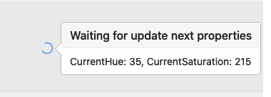

It is recommended to try to modify more attributes by issuing more commands or
the same command with slightly different parameters.

### Dev GUI and other protocols

Note that the Development UI is built for multiple protocol controllers to be
displayed in the same way, together with Z-Wave.

The Development UI does not reflect all the ZPC and Z-Wave capabilities, and
some functionalities may be present on the Dev UI despite not implemented in
the ZPC.

## Device Type and Role Type

The ZPC has a Generic Controller Device type and uses the following device classes:

* GENERIC_TYPE_GENERIC_CONTROLLER (0x01)
* SPECIFIC_TYPE_NOT_USED (0x00)

It uses the following Basic type in the NIF:

* BASIC_TYPE_STATIC_CONTROLLER (0x02)

These values can be configured using the ZPC configuration.

The ZPC uses the Central Static Controller (CSC) role type, which
supports and takes the SIS role by default.

The ZPC does not support the following network functionalities:

* Learn Mode
* Failed Replace

## Manufacturer-Specific Information

The ZPC uses the following manufacturer-specific information:

* Manufacturer ID : 0x0000
* Product Type    : 0x0005
* Product ID      : 0x0001
* Firmware ID     : 0x0001

## Z-Wave Plus Info Information

The ZPC uses the following Z-Wave Plus Info information:

* Role Type           : 0x0000 (CSC)
* Node Type           : 0x0000
* Installer Icon Type : 0x0100
* User Icon Type      : 0x0100

## Network Management Information

### Network Management

The ZPC can perform the following operations using the Development UI:

* Direct range and Network-Wide Inclusion (Add) of other nodes in the network.
* Direct range and Network-Wide Exclusion (remove) of other nodes (in any network).

Learn Mode and Controller Replication are not available.

#### Adding a Node

To add a new node in the current network, select the ZPC entry in the node list
and locate the "States" button. Select the "Add node" option.


The ZPC will go from Idle to Add node. Activate learn mode on the node that
you want to include in the network. When the network inclusion happens, a new
node will appear in the list of nodes.

To cancel an inclusion attempt, select the "Idle" option under the "States" button.

#### Removing a Node

To remove a node from its network (it can be either the ZPC's network or a
foreign network), select the ZPC entry in the node list
and locate the "States" button. Select the "Remove node" option.


The ZPC will go from Idle to Remove node. Activate learn mode on the node that
you want to exclude from its network. When the network exclusion happens, the ZPC
state will return to Idle. The ZPC state will return to idle automatically
after excluding a node.

To cancel an exclusion attempt, select the "Idle" option under the "States" button.

#### Management Operations for Individual Nodes

When a network management is to be targeted for a particular node, the list of
available commands is available in the node list page, under the **Commands** button.


* Interview will perform a new node Interview
* RemoveOffline will perform a Z-Wave Remove Failed Node.
* DiscoverNeighbors will request Z-Wave node to perform a neighbor discovery. It will have no effect for nodes includes with Z-Wave Long Range.

While a node is under interview, its status will be *Online interviewing*. When
The interview is over, its status moves back to *Online functional*.

When performing a RemoveOffline on a node, no visible update is made on the node
status, however, the ZPC node entry will move its network management state to
"Remove node".

When requesting a DiscoverNeighbors, no visible feedback will be available
on the UI.

## Command Class Information

The following table shows supported and controlled Z-Wave Command Classes by the ZPC.

| Command Class                  | Version | Support | Control | Security Level              | Comment |
| ------------------------------ | ------- | ------- | ------- | --------------------------- | ------- |
| Alarm Sensor                   |       1 |         |       x | N/A                         |         |
| Association                    |       2 |       x |       x | Network Scheme              |         |
| Association Group Info (AGI)   |       3 |       x |       x | Network Scheme              |         |
| Barrier Operator               |       1 |         |       x | N/A                         |         |
| Basic                          |       2 |         |       x | N/A                         |         |
| Battery                        |       3 |         |       x | N/A                         | Control Part is auto-generated. |
| Binary Sensor                  |       1 |         |       x | N/A                         | Control Part is auto-generated. |
| Binary Switch                  |       2 |         |       x | N/A                         |         |
| Central Scene                  |       3 |         |       x | N/A                         | Partial control: key attributes are not displayed in the UI. |
| Color Switch                   |       3 |         |       x | N/A                         | Partial Control:<br>1. Durations are ignored<br>2. No support for Start/Stop Level Change<br>3. No support for other Color Component IDs than 0,1,2,3,4 |
| Configuration                  |       4 |         |       x | N/A                         |         |
| Device Reset Locally           |       1 |       x |       x | Network Scheme              |         |
| Door Lock                      |       2 |         |       x | N/A                         | Control Part is auto-generated. |
| Firmware Update                |       7 |       x |       x | Network Scheme              |         |
| Inclusion Controller           |       1 |       x |       x | Unencrypted                 |         |
| Indicator                      |       3 |       x |       x | Network Scheme              |         |
| Manufacturer Specific          |       2 |       x |       x | Network Scheme              |         |
| Meter                          |       6 |         |       x | N/A                         | Partial control: <br>1. Meter Reset Command is not supported due to missing dotdot ZCL equivalent functionality. |
| Multi Channel                  |       4 |         |       x | N/A                         |         |
| Multi Channel Association      |       3 |       x |       x | Network Scheme              |         |
| Multi Command                  |       1 |       x |         | Unencrypted                 |         |
| Multilevel Sensor              |      11 |         |       x | N/A                         | Partial control: <br>1. Not all scales are supported<br>2. Not all types are shown in the UI. |
| Multilevel Switch              |       4 |         |       x | N/A                         |         |
| Notification                   |       8 |         |       x | N/A                         | Partial Control: <br>1. No Push/Pull discovery is done.<br>2. No Pull sensor support. <br>3. Unknown types are not supported. <br>4. No Regular probing is done.  |
| Powerlevel                     |       1 |       x |         | Network Scheme              |         |
| Scene Activation               |       1 |         |       x | N/A                         |         |
| Scene Actuator Configuration   |       1 |         |       x | N/A                         | No interview performed automatically. |
| Scene Controller Configuration |       1 |         |       x | N/A                         |         |
| Security 0                     |       1 |       x |       x | Unencrypted                 |         |
| Security 2                     |       1 |       x |       x | Unencrypted                 |         |
| Supervision                    |       2 |       x |       x | Unencrypted                 |         |
| Thermostat Mode                |       3 |         |       x | N/A                         | Partial Control: Not all modes can be set |
| Thermostat Setpoint            |       3 |         |       x | N/A                         | Partial Control: <br>1. No discovery of ambiguous types in v1-v2 <br>2. Only a few setpoints can be configured. <br>3. Precision/size fields in the set are determined <br>automatically by the controller.  |
| Time                           |       1 |       x |         | Unencrypted                 |         |
| Transport Service              |       2 |       x |       x | Unencrypted                 |         |
| Version                        |       3 |       x |       x | Network Scheme              |         |
| Wake Up                        |       3 |         |       x | N/A                         |         |
| Z-Wave Plus Info               |       2 |       x |       x | Unencrypted                 |         |

### Alarm Sensor Command Classes Information

The ZPC controls the Alarm Sensor Command Class. It is possible to
see the current state of an Alarm Sensor supporting node.

#### Node status

The Alarm Sensor Command Class will be mapped to the IasZone cluster.
If any alarm state has a non-zero value, the IasZone Zone Status Alarm1 bit
will be set to 1.


#### Sending commands

There is no available command to be sent for this Command Class

### Association / Multi Channel Association Command Classes Information

The ZPC supports the following Association Groups
| Grouping Identifier            | Maximum Number of Associations | Group Name | Usage/Trigger                                       |
| ------------------------------ | ------------------------------ | ---------- | --------------------------------------------------- |
| 1                              | 10                             | Lifeline   | ZPC reset will issue a Device Reset Locally Command |

The ZPC controls the Association and Multi Channel Association.
By default, it establishes lifeline associations or establishes associations if
some controlled Command Classes require it. (i.e. Notification, Central Scene,
etc.)

It is not possible to establish arbitrary associations between 2 nodes.
However, it is possible to establish bulk associations between 2 nodes in the network
if the following conditions are fulfilled:

* The 2 nodes operate using Z-Wave (and not LR) and have identical highest security levels.
* The destination is not an NL node.
* The source node has AGI information and sends commands corresponding to a bindable
  cluster in the table below
* The destination supports the Command Class that the source is sending.

| Command Class                        | Command                               | Bindable cluster           |
| ------------------------------------ | --------------------------------------| -------------------------- |
| COMMAND_CLASS_BASIC                  | BASIC_SET                             |  OnOff                     |
| COMMAND_CLASS_SWITCH_BINARY          | SWITCH_BINARY_SET                     |  OnOff                     |
| COMMAND_CLASS_SWITCH_MULTILEVEL      | SWITCH_MULTILEVEL_SET                 |  Level                     |
| COMMAND_CLASS_SWITCH_MULTILEVEL      | SWITCH_MULTILEVEL_START_LEVEL_CHANGE  |  Level                     |
| COMMAND_CLASS_SWITCH_MULTILEVEL      | SWITCH_MULTILEVEL_STOP_LEVEL_CHANGE   |  Level                     |
| COMMAND_CLASS_INDICATOR              | INDICATOR_SET                         |  Identify                  |
| COMMAND_CLASS_DOOR_LOCK              | DOOR_LOCK_OPERATION_SET               |  DoorLock                  |
| COMMAND_CLASS_DOOR_LOCK              | DOOR_LOCK_CONFIGURATION_SET           |  DoorLock                  |
| COMMAND_CLASS_WINDOW_COVERING        | WINDOW_COVERING_SET                   |  WindowCovering            |
| COMMAND_CLASS_WINDOW_COVERING        | WINDOW_COVERING_START_LEVEL_CHANGE    |  WindowCovering            |
| COMMAND_CLASS_WINDOW_COVERING        | WINDOW_COVERING_STOP_LEVEL_CHANGE     |  WindowCovering            |
| COMMAND_CLASS_BARRIER_OPERATOR       | BARRIER_OPERATOR_SET                  |  BarrierControl            |
| COMMAND_CLASS_THERMOSTAT_MODE        | THERMOSTAT_MODE_SET                   |  Thermostat                |
| COMMAND_CLASS_THERMOSTAT_SETPOINT    | THERMOSTAT_SETPOINT_SET               |  Thermostat                |
| COMMAND_CLASS_THERMOSTAT_FAN_MODE    | THERMOSTAT_FAN_MODE_SET               |  FanControl                |
| COMMAND_CLASS_HUMIDITY_CONTROL_MODE  | HUMIDITY_CONTROL_MODE_SET             |  DehumidificationControl   |
| COMMAND_CLASS_SWITCH_COLOR           | SWITCH_COLOR_SET                      |  ColorControl              |
| COMMAND_CLASS_SCENE_ACTIVATION       | SCENE_ACTIVATION_SET                  |  Scenes                    |

Note that it will be allowed to establish bindings towards
the ZPC in most cases.

#### Node status

It is not possible to see the full association groups details from the Dev GUI.
However, The binding page will allow to add cluster bindings, which in turn will
add and remove associations.


The list of cluster bindings will be shown on this page.


* **Bindable Cluster List**: Indicates if some association groups send commands from
  the binding table above, and show which clusters are available for binding.
* **Table full**: If set to true, new bindings will be rejected, due to
  a lack of capacity to add more destinations.
* **Binding table**: Shows the current bindings. Green color indicates that the
  binding is to be established and the red color indicates that the binding is
  to be removed.

Note that for example, if a node has 2 Association groups sending Basic Set Commands,
a binding to the OnOff cluster will result in associate all groups sending
these commands.

#### Sending commands

The Bind/Unbind commands will send Association Set/Remove commands.


To make an Association (Binding) the following fields have to be provided:

* **DestinationUnid**: This is the NodeID/destination of the association
* **DestinationEp**: This is the Endpoint destination of the association, set
  to 0 to send to the Root Device. The ZPC will select NodeID/Endpoint
  Associations types automatically
* **ClusterName**: The ZCL type of functionality to be associated. Refer to the
  table above to see how ZCL clusters map to AGI Commands.

Note that if the "Bindable Cluster List" is empty, there will not be any
available clusters in the "Cluster Name" dropdown and no associations will be
established.

This could happen because of there is no AGI. The list of clusters are populated
when nodes provide AGI information.
Further, some bind commands will have no effect due to association restrictions.
Refer to the list of conditions described at the beginning of the section.

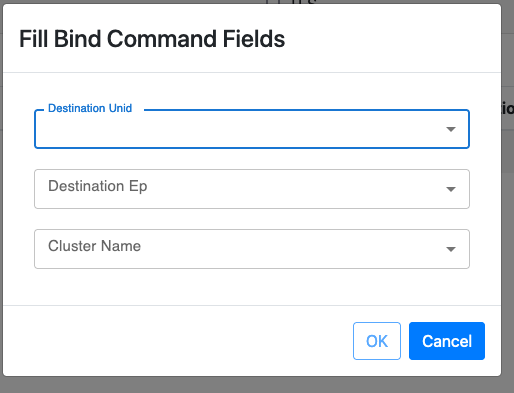

### Barrier Operator Command Class Information

The ZPC controls the Barrier Operator Command Class. It is possible to request
a Barrier Operator node to open/close and see its last known state.

It is not possible to control the state of subsystems, due to the lack of
equivalent functionality on the UCL data model.

#### Node status

To see the state of the Barrier Operator Command Class.
Select the BarrierControl page from the left menu on the Dev GUI.

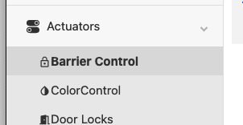

The Position attribute indicate the percentage open.

* 0 Represents a closed barrier
* 100 Represents a fully open barrier


#### Sending commands

The GoToPercent command can be used to initiate opening or closing of the
Barrier Operator Command Class.

* GoToPercent with value 0 will issue a Barrier Operator Set (Target Value = 0x00)
* GoToPercent with value >0 will issue a Barrier Operator Set (Target Value = 0xFF)

The Stop command has no effect.

### Basic Command Class Information

The ZPC controls the Basic Command Class. It is possible to set and
see the current state of an unknown actuator node using Basic.

Basic will be used, only if the supporting node does not support any actuator
command classes that the ZPC controls (fully or partially). In this case, the
ZPC will attempt to discover if the Basic Command Class is supported by issuing
a Basic Get Command. If the node replies, the Basic functionality will be
presented as an OnOff functionality.

It is not possible to see if the ZPC is using Binary Switch or Basic Command
Class.

#### Node status

To see the state of the Basic Command Class, select the OnOff page
from the left menu on the Dev GUI.


The state of the node is displayed for each entry, it only consist in
a single On/Off state, represented with a small light bulb.


#### Sending commands

To trigger a Basic Set, select one of the 3 available commands.
(On, Off, Toggle).

These command will have an effect only if there is a difference between the
reported state and the command indication. i.e. the On command for a node already
on will not trigger any command to be sent.

### Battery Command Class Information

The ZPC controls the Battery Command Class. It is possible to
see the current Battery state for supporting nodes.

#### Node status

To see the state of the Battery Command Class, select the Battery page
from the left menu on the Dev GUI.

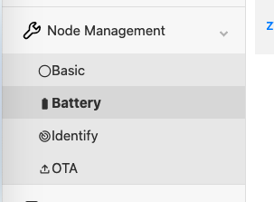

The last reported battery percentage will be visible on the attribute list.
The Battery Low indication will be set to "true" if the battery level is less
than 10% or if the node has reported a battery = 0xFF notification.


#### Sending commands

It is not possible to send Battery Commands to supporting nodes.

### Binary Switch Command Class Information

The ZPC controls the Binary Switch Command Class. It is possible to set and
see the current level of a binary switch supporting node.

#### Node status

To see the state of the Binary Switch Command Class, select the OnOff page
from the left menu on the Dev GUI.


The state of the node is displayed for each entry, it only consist in
a single On/Off state, represented with a small light bulb.


#### Sending commands

To trigger a Binary Switch Set, select one of the 3 available commands.
(On, Off, Toggle).

These command will have an effect only if there is a difference between the
reported state and the command indication. i.e. the On command for a node already
on will not trigger any command to be sent.


### Central Scene Command Class Information

The ZPC controls the Central Scene Command Class. It is possible to see which
scene is active or has been activated last in supporting nodes.

#### Node status

To see the state of the Central Scene Command Class, select the Scenes page
from the left menu on the Dev GUI.


The state of the node is displayed for each entry, it consists in
the following attributes:

* **Scene count**: The total number of scenes/key attributes combinations that
could be used by the supporting node.
* **Current Scene**: The active or last active scene. This is a unique number
derived from the Scene Number and Key attribute combination, it is in the range
[0 ; **Number of Scenes** - 1]. The Scene is calculated as follow:
*Current Scene = ((SceneID - 1) * Max Key Attribute) + (Key Attribute);*
If no Central Scene Notification has been received yet, this value stays undefined.
* **Scene valid**: Indicates if the Current Scene is active,
meaning that the scene was activated within the last 5 seconds or is being
activated (e.g. button is being held down). When this is set to false,
it means that the *Current Scene* attribute represents the last active scene.

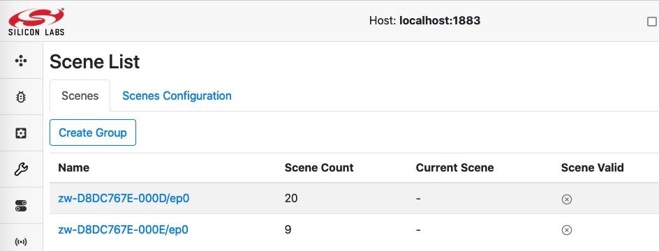

#### Sending commands

It is not possible to issue Central Scene commands to supporting nodes.

#### Color Switch Command Class Information

The ZPC controls (partially) the Color Switch Command Class.

##### Node status

The state of a Color Switch node can be found on ColorControl cluster page.

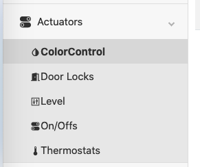

Note that nodes will be presented on the ColorControl will also display a Level
and OnOff cluster capability. These capabilities are normally mapped if the
supporting node also supports Binary Switch Command Class and/or the Multilevel Switch
Command Class, but they will be emulated if the supporting node does not support
these Command Classes.

Note that the Level value depends on the OnOff value, and the Color values
depend on the Level value. Also note that the maximum level is 99 if the
Level Cluster is mapped to Multilevel Switch, and 255 if the Level Cluster
is emulated.

The ColorControl cluster will operate using the
[Hue Saturation Lightness (HSV)](https://en.wikipedia.org/wiki/HSL_and_HSV)
system to determine colors.

The lightness is taken from the Multilevel Switch value, or if the node supports
Binary Switch Command Class, it will be calculated based on the RGB values.

* **Current Hue**: Value from 0 to 254 representing the Hue in degrees.
  Get the real Hue (range [0;360]) by doing **Current Hue** / 254 * 360
* **Current Saturation**: Value from 0 to 254 representing the Saturation.
  Get the real saturation (range [0;1]) by doing **Current Saturation** / 254.

The current estimated Hue and Saturation are shown in the ColorControl page.


If the node has Cold and/or Warm white capabilities, the DevGUI will also
show an estimate of its color temperature using the
[Mired scale](https://en.wikipedia.org/wiki/Mired).

Nodes will operate either using the **CurrentHueAndCurrentSaturation** or
**ColorTemperatureMireds**, but not both. This is indicated by the
**Color Mode** column.

The Color Mode is determined by which command has last been sent to the node.
The following commands will change the **Color Mode** to **ColorTemperatureMireds**:

* MoveToColorTemperature
* MoveColorTemperature
* StepColorTemperature

The color temperature is determined by mixing the Warm and Cold white components

* **Temperature Mireds**: Current estimated value of the light temperature
* **MinMireds**: Minimum possible value (cold white)
* **MaxMireds**: Maximem possible value (warm white)

The following commands will change the **Color Mode** to **CurrentHueAndCurrentSaturation**:

* MoveToHue
* MoveHue
* StepHue
* MoveToSaturation
* MoveSaturation
* StepSaturation
* MoveToHueAndSaturation

Note that setting colors will require that both the OnOff settting is set to
On and Level setting is set to a value different than 0. Setting the color before
the OnOff and Level setting will result in inaccurate mappings.

When running with the **CurrentHueAndCurrentSaturation** **Color Mode**, the
Multilevel Switch value will be scaled proportionally to the highest color
component value. For example, if Green is set to 255, Multilevel Switch value
will be 99, if all color components are set to 127, Multilevel Switch value will
be 49.
If the highest color component is set to 64, Multilevel Switch will be set at 25, etc.

Note that with **Saturation** set to 0, the color settings will be ambiguous,
as any hue value will result in a white color. RGB component combination of
equal values will trigger the Saturation to be 0.

Here are a few mappings, assuming that the ZCL MaxLevel value is 99:

* HSV(0,254,50) <=> RGB (129,0,0)
* HSV(43,254,50) <=> RGB (127,129,0)
* HSV(149,250,99) <=> RGB (4,125,255)
* HSV(0,0,50) <=> RGB (129,129,129)
* HSV(0,254,99) <=> RGB (255,0,0)
* HSV(85,254,99) <=> RGB (0,255,2)
* HSV(170,254,99) <=> RGB (4,0,255)

Instead, if the ZCL MaxLevel is for example 255, the following mappings would
apply:

* HSV(0,254,128) <=> RGB (128,0,0)
* HSV(43,254,128) <=> RGB (127,128,0)
* HSV(149,250,255) <=> RGB (4,125,255)
* HSV(0,0,128) <=> RGB (128,128,128)
* HSV(0,254,255) <=> RGB (255,0,0)
* HSV(85,254,255) <=> RGB (0,255,2)
* HSV(170,254,255) <=> RGB (4,0,255)

##### Sending commands

It is possible to issue Color Switch Set Commands by using the
MoveToHueAndSaturation or MoveToColorTemperature Commands.

Given that the full color consists of Hue, Saturation and Lightness,
a color picker is available and will send both Level/ColorControl commands
automatically to match a given RGB combination whenever it is clicked.

Due to rounding errors, the reported values by the device may drift a little
after being set.

**Note**: Durations are completely ignored at the moment and all commands will
be sent with an instantaneous value.

**Note**: Make sure that the OnOff setting is On in the OnOff cluster,
before setting the color.

**Note**: Make sure that the Level setting is higher than 0 in the Level cluster,
before setting the color.

### Configuration Command Class Information

The ZPC controls the Configuration Command Class. It is possible to discover
configuration parameters and set the parameter values. In addition, it is also
possible to reset all configuration parameter values to their default values.

#### Node status

To see the state of the Configuration Command Class, one could select
the Configuration Parameters page on the left menu of the Dev GUI.

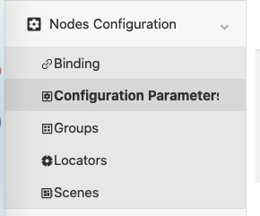

The state of the node is displayed for each entry representing supported
configuration parameter IDs. An example is shown in the following figure:


If the device support Configuration Command Class version 1 or 2, the user
must initiate the discovery of the configuration parameters by using the
DiscoverParameters command and indicate the configuration parameter IDs
that are expected to be supported by the supporting node.


#### Sending commands

To set the configuration parameter value, one could select SetParameter command
and insert the configuration parameter ID and desired value. However, it is not
possible to set the parameter to its default value using "Default" bit flag.

The DefaultResetAllParameters is available from version 4 and will request
the supporting node to reset all its configuration parameters to their default value.

### Device Reset Locally Command Class Information

The ZPC can be reset to default. The operation is available with other Network
Management operations in the Dev GUI main page.


When initiating a reset operation, the ZPC will change it state to "Reset"


The ZPC will attempt to notify the lifeline destination for a short while and
reset its network afterwards. The ZPC node entry and all the nodes in its
network will disappear from the UI when the reset operation is completed.

The ZPC will then create a new network and re-spawn as a new node.

When a node is notifying that it has been reset, the ZPC will perform a Remove
Failed Node operation.

#### Door Lock Command Class Information

The ZPC controls the Door Lock Command Class. It is possible to see and change
the state of nodes supporting the Door Lock Command Class.

It is not possible to configure the Door Lock (Door Lock Configuration Commands).

#### Node status

To see the state of a Door Lock, open the Lock menu on the left hand side.

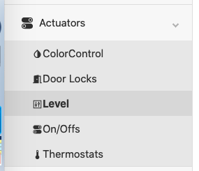

The state of the node will be displayed for each entry.

* A green door icon means that the door is secured.
* A red door icon means that the door is unsecured.


#### Sending commands

To trigger a Door Lock Operation Set, select either the LockDoor or UnLockDoor command.
A pop-up will appear, asking about a PINOrRFIDCode. This parameter is for ZigBee
nodes, and can be ignored for Z-Wave nodes. Press send without filling anything.


### Indicator Command Class Information

The ZPC both supports and controls the Indicator Command Class.

#### Support

The ZPC supports identifying itself using an on-board green LED on the top-side of the
Raspberry-Pi reference platform. On a Raspberry-Pi 4, the LED is located next to the
red power-LED, both of which are located next to the USB-C power-connector. Please note
that some Raspberry-Pi cases are opaque and some of those do not expose those
LEDs to the outside (e.g. with a light-pipe), so the top-cover may need to be removed in
order to see the LEDs.

#### Node status

To see the state of a Indicator, open the Identify menu on the left hand side.


The state of each identify indicator will be displayed for each entry.
It will only display the duration, in seconds, that the node is identifying.
For example, a node identifying for 66 seconds will be shown as follows:


#### Sending commands

To trigger an Identify command, select the Identify command.
A pop-up will appear, asking about the duration. Set the value to 2 in order
to trigger the Identify command.


#### Meter Command Class Information

The ZPC controls (partially) the Meter Command Class.
The meter values will be queried and mapped whenever possible to ZCL clusters.
##### Node status

It is possible to see some of the metering data in DevGUI. Instantaneous
and accumulated values are separated.

###### Accumulated values

Cumulated values are mapped to the Metering Cluster.
All Meter types will be mapped for Cumulated values.

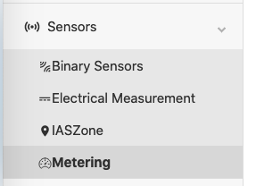

In the Metering page, the following is displayed:

* **Summation Delivered**: Import or default rate type
* **Summation Received**: Export rate type

The following units are used:

* Electric Meter: kWh
* Gas Meter: Cubic meter or Cubic feet, depending on the Z-Wave availability
* Water Meter: Cubic meter or Cubic feet, depending on the Z-Wave availability
* Heating Meter: kWh
* Cooling Meter: kWh


###### Instantaneous values

Instantaneous values for the Electric Meter types are mapped to the
Electrical Measurement Cluster.


The last reported values for each node will be displayed in the cluster view.


Note that ZCL uses the following units:

* Active Power: W*10 (deci-Watts)
* RMS Current: A (Amperes)
* Power Factor: Unitless
* RMS Voltage: V (Volts)
* Reactive Power: kVar

##### Sending commands

It is not possible to send Meter Commands using the DevGUI. Meter values are
probed every 6 hours if no update was received from the end nodes.

#### Multilevel Sensor Command Class Information

The ZPC controls (partially) the Multilevel Sensor Command Class.
The sensor values will be queried and mapped whenever possible to ZCL clusters.

Not all sensor values are available on the Dev GUI and unknown values are not
forwarded to the Dev GUI.

##### Node status

Sensors values (known and unknown) are probed every 6 hours if no update was
received from the end nodes.

The following Sensor Types/Scales and their values are presented to the UI:

| Sensor Type                          | Scale                   | Mapped measurement                         |
| ------------------------------------ | ----------------------- | ------------------------------------------ |
| Carbon dioxide (0x11)                | 0x00 (ppm)              | Carbon dioxide (ppm)                       |
| Carbon monoxide (0x28)               | 0x01 (ppm)              | Carbon monoxide (ppm)                      |
| Carbon monoxide (0x28)               | 0x00 (mol.m-3)          | Carbon monoxide (ppm)                      |
| Air Temperature (0x01)               | 0x00 and 0x01 (C and F) | Temperature (C * 100)                      |
| Humidity (0x05)                      | 0x00 (%)                | Relative Humidity (Percent * 100)          |
| Soil Humidity (0x29)                 | 0x00 (%)                | Soil Moisture (Percent * 100)              |
| Water Acidity (0x43)                 | 0x00 (pH)               | pH Measurement (pH * 100)                  |
| Soil Reactivity (0x2A)               | 0x00 (pH)               | pH Measurement (pH * 100)                  |
| Atmospheric Pressure (0x08)          | 0x00 (kPa)              | Pressure Measurement (kPa * 10)            |
| Barometric Pressure (0x09)           | 0x00 (kPa)              | Pressure Measurement (kPa * 10)            |
| Water Pressure (0x39)                | 0x00 (kPa)              | Pressure Measurement (kPa * 10)            |
| Suction Pressure (0x4E)              | 0x00 (kPa)              | Pressure Measurement (kPa * 10)            |
| Discharge Pressure (0x4F)            | 0x00 (kPa)              | Pressure Measurement (kPa * 10)            |

Unknown values are not presented in the Dev GUI.
The screenshot belows shows an example with temperature measurements:

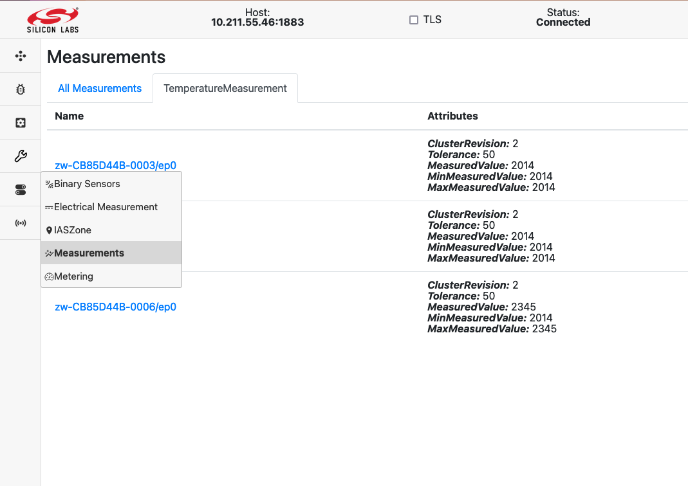

##### Sending commands

It is not possible to send Multilevel Sensor Commands.

### Multilevel Switch Command Class Information

The ZPC controls partially the Multilevel Switch Command Class. It is possible
to set and see the current level of a Multilevel Switch supporting node.

However, the model on which the Unify system and
[Dev GUI](../dev_ui/dev_gui/readme_user.md) operate is based on
The Dotdot model.

This means that Multilevel Switch supporting node will be represented with both
an OnOff and a Level functionality. The Level setting can be changed
independently, but will be interpreted in conjunction with the OnOff State.

In short:

* If OnOff is off, the Multilevel Switch value at the end node will
be 0, no matter what the current level shows.

* If OnOff is on, the Multilevel Switch value at the end node will be according
to the level setting.

**Note**: Multilevel Switch mapping will behave differently if Color Switch
is supported. In this case, refer to the Color Switch Command Class information.

#### Node status

To see the state of the Multilevel Switch Command Class, select the Level page
from the left menu on the Dev GUI.


The state of the node will be displayed for each entry. The following attributes
are available:

* CurrentLevel represents the Multilevel Switch Level
* OnOffTransitionTime represents the Multilevel Switch duration


#### Sending commands

To trigger a Multilevel Switch Set, select the MoveToLevelWithOnOff command.
A pop-up will appear, asking about the parameters.

* CurrentLevel: Multilevel Switch Level, from 0 to 99. It is not possible to send
  the value 0xFF.
* OnOffTransitionTime: Transition time, in tenth of seconds, from 0 to 65534.
The transition time will be floored to the nearest Z-Wave supported value.

It is possible to specify the 0xFF duration for Multilevel Switch Set
Commands by setting the OnOffTransitionTime to 1.

For example, this command will instruct to go to 50% in 25 seconds.

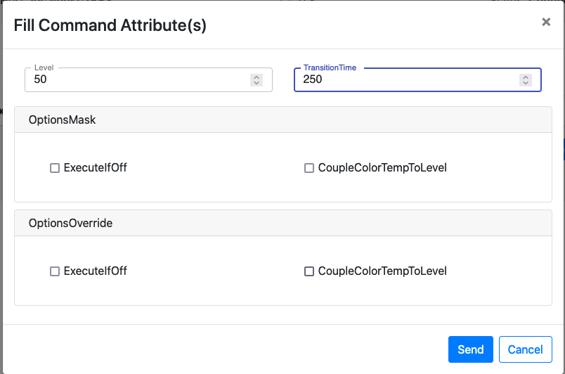

It is not possible to issue Multilevel Switch Start/Stop level change.

### Notification Command Class Information

The ZPC controls the Notification Command Class partially.
It is possible to get some information from nodes sending notifications
states/events to the ZPC.

Due to the very diverse nature of the Notifications states and events that
can be reported via the Command Class, information from the command class is
displayed in a few different places in the
[Dev GUI](../dev_ui/dev_gui/readme_user.md).


#### Node status

The following event/states are visible in the Dev GUI.

##### OccupancySensing

The following notifications states/events will be shown in the OccupancySensing
cluster (displayed as Binary Sensors):


The occupancy sensing attribute is shown in the **State** column of the
table:


The occupancy sensing will be shown as Occupied when receiving:

* Home Security - Motion Detection
* Home Security - Motion Detection with location
* Home Security - Intrusion
* Home Security - Intrusion (location provided)
* Acces Control - Door window open

The occupancy sensing will be shown as UnOccupied when receiving:

* Home Security - State Idle (Motion Detection)
* Home Security - State Idle (Motion Detection with location)
* Home Security - State Idle (Intrusion)
* Home Security - State Idle (Intrusion location provided)
* Acces Control - Door window closed

##### IASZone

The following notifications states/events will be shown in the IASZone
cluster.


The state of an IASZone is shown in the **Zone Status** column of the
table, with a JSON representation:


The following notification will be mapped to the following bits:

* Home Security - Motion detected -> Alarm2
* Home Security - Intrusion -> Alarm1
* Home Security - Tampering -> Tamper

#### Sending commands

It is not possible to send commands for the Notification Command Class.

### Scene Activation Command Class Information

The Scene Activation Command Class is fully controlled by the ZPC.
Nodes supporting the Scene Activation Command Class will be presented
in the Scenes page on the Dev GUI.


It will be assumed that 255 scenes are supported. Note that the UI will
allow to activate scenes 1..255 by setting values 0..254.

The *RecallScene* Command will issue a Scene Activation Set Command.

TransitionTime is specified in deci-seconds. (i.e. 10 = 1 second).
It is possible to specify the 0xFF duration for the Scene Activation Set
Command by setting the TransitionTime to 1.
Else the duration will match the floored value of the specified transition time.

### Scene Actuator Configuration Command Class Information

The Scene Actuator Configuration Command Class is controlled by the ZPC.

Nodes supporting the Scene Actuator Configuration Command Class will be
presented in the Scenes page on the Dev GUI.


Note that no interview will be performed automatically, i.e. the
*Scene Actuator Configuration Get Command* for each of the 255 Scene IDs
are skipped.

It is possible to instruct the ZPC to issue a
*Scene Actuator Configuration Get Command* by using the *ViewScene* Command
in the DevGUI. It will not be possible to see the contents of the report via
the DevGUI.

It will be assumed that 255 scenes are supported. Note that the UI will
associate scenes 1..255 to values 0..254.

It is possible to issue a *Scene Actuator Configuration Set Command* using the
*StoreScene* Command in the DevGUI.

### Scene Controller Configuration Class Information

The Scene Controller Configuration Command Class is controlled by the ZPC.

No interaction with this Command Class is available via the DevGUI at the
moment.

### Security 0 - Security 2 Command Classes Information

The ZPC supports and controls the Security 2 and Security 0 Command Classes.
As the ZPC does not support Learn Mode, the set of granted keys is always as
shown in the following table:

| Security Class                 | Protocol                                    |
| ------------------------------ | ------------------------------------------- |
| S2 Access Control              | Z-Wave and Z-Wave Long Range                |
| S2 Authenticated               | Z-Wave and Z-Wave Long Range                |
| S2 Unauthenticated             | Z-Wave                                      |
| S0                             | Z-Wave                                      |

#### Node status

It is possible to see the highest granted key of each node in the network,
using the DevGUI, on the node page.


The Security information will not indicate if a node operates with the Z-Wave
or Z-Wave Long Range protocol.

#### Sending commands

It is not possible to issue S0/S2 commands using the DevGUI.

### Thermostat Setpoint and Thermostat Mode Command Classes Information

The ZPC controls the Thermostat Setpoint and Thermostat Mode Command Classes.
It is possible to set the mode and setpoints of supporting nodes.

#### Node status

The state of Multilevel Sensor (temperature sensor), Thermostat Setpoint and
Thermostat Mode Command Classes is aggregated in the Thermostat page
located on the left menu in the Dev GUI.


The combined state of these command classes will be presented in the UI:

* Temperature represents the Multilevel Sensor reported temperature (Sensor type 0x01).
* Heating Setpoint represents the Heat Setpoint from the Thermostat Setpoint Command Class.
* Cooling Setpoint represents the Cool Setpoint from the Thermostat Setpoint Command Class.
* System Mode represents the current mode of from the Thermostat Mode Command
Class.


#### Sending commands

There are 2 available commands for Thermostats by default:
* WriteAttributes (wrench icon)
* SetpointRaiseOrLower

##### WriteAttributes Command

To change the Thermostat Mode and/or setpoints, you have to click on the
wrench icon and modify the attributes values in the dialog.


In the Thermostat Attributes dialog,
all temperatures are in centi-celcius (1/100 of a Celsius degree)

* Heating Setpoint will trigger a Thermostat Setpoint Set with the temperature
for the indicated mode.
* Cooling Setpoint will trigger a Thermostat Setpoint Set with the temperature
for the indicated mode.
* System Mode will trigger a Thermostat Mode Set with the indicated mode. The
  Following values can be configured (and will be sent to the device if supported):
  * Off
  * Auto
  * Cool
  * Heat

##### SetpointRaiseOrLower Command

The SetpointRaiseOrLower command will apply an offset to the current
setpoint(s).


The "Amount" is the offset in deci-celcius (1/10 of a Celcius degree) to offset
the current cool, heat or both setpoints. For example, if a user selects
Both and -17 in the amount, it will lower both the cool and heat setpoints
by 1.7 degrees.

Note that Amount is processed as a int8_t value, so the acceptable range is
[-128..127], so from -12.8 to +12.7

## SmartStart Information

The ZPC supports including other nodes using SmartStart. Detailed
steps to manipulate the SmartStart list are also given in the
[Dev GUI User's Guide](../dev_ui/dev_gui/readme_user.md).

### SmartStart List Format

The SmartStart list is present in the Dev GUI using the SmartStart button in
the left menu.

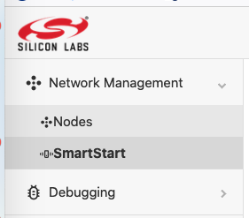

The SmartStart list will be displayed as shown below.


The **DSK** indicates the DSK of the node.
The **Include** tick-mark indicates if the node should be included or not.
In the example above, the third entry will not be included upon inclusion requests.

The **Unid** field indicates the unique identifier assigned to the node.
A non-empty value means that it is included in our network.

If the ZPC detected that the node is included in another network and needs to be
either excluded manually or reset to default before joining our network,
a small warning icon will be shown in the "Include" column.

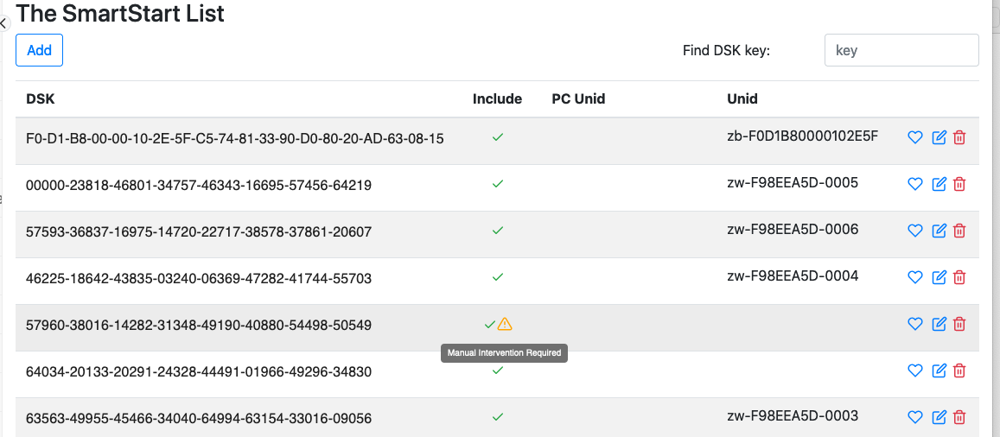

### Modifying SmartStart List Entries

Click on the little pen icon to modify an entry. You will be able to change
the Include tickbox and the Unid.

It is not recommended to remove the Unid, unless you know that the node has left
the network silently.

Click on the Save Icon to save the modifications.


### Removing SmartStart List Entries

Click on the little trash can icon to remove an entry.

Note that it the entry has a Unid assigned, it will stay in the network until
reset to default or excluded.


### Z-Wave Long Range Support

The ZPC can operate as a Z-Wave Long Range controller, operating both on
Z-Wave and Z-Wave Long Range PHY/MAC.

Nodes can be included using Z-Wave Long Range, if the ZPC runs with the
US_LR RF region.

Go to the SmartStart list and add an entry, then click the heart icon to select
the preferred protocol for inclusion.


Pick Z-Wave Long Range in the pop-up. The SmartStart inclusion will now be
performed using Z-Wave Long Range.

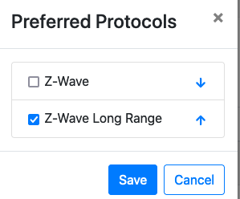

The order of the protocols matters only if you select both Z-Wave and Z-Wave
Long Range.

### SmartStart Supported Protocol Detection

The ZPC can perform SmartStart inclusions both for Z-Wave and Z-Wave
Long Range nodes.

The list of supported protocols for a DSK entry is not advertised in
the Unify SmartStart list, which means that the ZPC, in some cases, needs to discover
which protocols are supported/in range for the SmartStart entry.

If the PreferredProtocols in the SmartStart list entry is contains a single value,
the ZPC will only attempt to include the node with the protocol indicated in the
PreferredProtocols, without any discovery.

If PreferredProtocols contains no value, the ZPC will use its default configured
priority list for inclusion protocols.

If PreferredProtocols contains more than one value, the ZPC will use this list to
attempt to include the node.

If the ZPC has several inclusion protocols candidates either from the
PreferredProtocols or based on its configuration, it will first listen for
SmartStart Prime commands to detect which protocols are available
from the node.

In the following use case, the node supports all protocols among two candidates:

```{uml}
' Style for the diagram
skinparam classFontColor black
skinparam classFontSize 10
skinparam classFontName Helvetica
skinparam sequenceMessageAlign center
skinparam shadowing false
skinparam ArrowColor #000000
skinparam ParticipantBackgroundColor #FFFFFF
skinparam ParticipantBorderColor #480509
skinparam SequenceLifeLineBorderColor #001111
skinparam SequenceLifeLineBorderThickness 2
skinparam NoteBackgroundColor #FFFFFF
skinparam NoteBorderColor #000000
skinparam ActorBackgroundColor #FFFFFF
skinparam ActorBorderColor #480509

hide footbox
title Inclusion Protocol candidate discovery

' List of participants
participant "SmartStart list" as upvl
participant "ZPC" as zpc
participant "End node" as node

upvl -> zpc: New Entry in the SmartStart list.\n 2 possible inclusion protocols.

rnote over zpc, node: <b>Initiate protocol discovery</b>

rnote left of zpc: known protocols: none

node -> zpc: Z-Wave Long Range\n<b>SmartStart Prime

rnote left of zpc: known protocols:\n1. Z-Wave Long Range

node -> zpc: Z-Wave\n<b>SmartStart Prime

rnote left of zpc: known protocols:\n1. Z-Wave Long Range\n2. Z-Wave

rnote over zpc, node: <b>All candidates received\n<b>Stopping Protocol discovery.

rnote over zpc, node: Initiate SmartStart Inclusion \nat the next SmartStart Inclusion Request.
```

Example, if the node supports only 1 protocol among 2 candidates:

```{uml}
' Style for the diagram
skinparam classFontColor black
skinparam classFontSize 10
skinparam classFontName Helvetica
skinparam sequenceMessageAlign center
skinparam shadowing false
skinparam ArrowColor #000000
skinparam ParticipantBackgroundColor #FFFFFF
skinparam ParticipantBorderColor #480509
skinparam SequenceLifeLineBorderColor #001111
skinparam SequenceLifeLineBorderThickness 2
skinparam NoteBackgroundColor #FFFFFF
skinparam NoteBorderColor #000000
skinparam ActorBackgroundColor #FFFFFF
skinparam ActorBorderColor #480509

hide footbox
title Inclusion Protocol candidate discovery

' List of participants
participant "SmartStart list" as upvl
participant "ZPC" as zpc
participant "End node" as node

upvl -> zpc: New Entry in the SmartStart list.\n 2 possible inclusion protocols.

rnote over zpc, node: <b>Initiate protocol discovery</b>

rnote left of zpc: known protocols: none

node -> zpc: Z-Wave Long Range\n<b>SmartStart Prime

rnote left of zpc: known protocols:\n1. Z-Wave Long Range

node -> zpc: Z-Wave Long Range\n<b>SmartStart Prime

rnote left of zpc: known protocols:\n1. Z-Wave Long Range

rnote over zpc, node: <b>Cycle detected for supported protocols\n<b>Stopping Protocol discovery.

rnote over zpc, node: Initiate SmartStart Inclusion \nat the next SmartStart Inclusion Request.
```

The result of this procedure (protocol discovery) will not be saved and will be
performed at every SmartStart inclusion attempt. It allows to re-assess, every
time if a protocol became available. The list of protocols may change due to
firmware update or simply due to radio conditions. Z-Wave nodes may
come within NWI range after including more nodes in the network, and subsequently join themselves.
Therefore, this protocol discovery procedure may happen at every inclusion attempt.

In a Z-Wave network, NWI will be enabled when listening to SmartStart Primes messages
and repeated frames will be received by the ZPC. To prevent
repeated frames from triggering an early conclusion on which protocols are supported, the
ZPC will apply a back-off after receiving a prime message. The back-off should be
larger than two seconds.

```{uml}
' Style for the diagram
skinparam classFontColor black
skinparam classFontSize 10
skinparam classFontName Helvetica
skinparam sequenceMessageAlign center
skinparam shadowing false
skinparam ArrowColor #000000
skinparam ParticipantBackgroundColor #FFFFFF
skinparam ParticipantBorderColor #480509
skinparam SequenceLifeLineBorderColor #001111
skinparam SequenceLifeLineBorderThickness 2
skinparam NoteBackgroundColor #FFFFFF
skinparam NoteBorderColor #000000
skinparam ActorBackgroundColor #FFFFFF
skinparam ActorBorderColor #480509

!pragma teoz true

hide footbox
title Inclusion Protocol with NWI repeaters

' List of participants
participant "SmartStart list" as upvl
participant "ZPC" as zpc
participant "NWI Repeater" as repeater
participant "End node" as node

upvl -> zpc: New Entry in the SmartStart list.\n 2 possible inclusion protocols.

rnote over zpc, node: <b>Initiate protocol discovery</b>

rnote left of zpc: known protocols: none

node -> zpc: Z-Wave\n<b>SmartStart Prime
&node -> repeater

rnote left of zpc: known protocols:\n1. Z-Wave
rnote left of zpc: Start back-off for Z-Wave
activate zpc

repeater -> zpc: Z-Wave\n<b>SmartStart Prime
rnote left of zpc: Ignoring repeater\nmessage in back-off


zpc -> zpc: end of back-off for Z-Wave
deactivate zpc

node -> zpc: Z-Wave\n<b>SmartStart Prime

rnote left of zpc: known protocols:\n1. Z-Wave
rnote over zpc, node: <b>Cycle detected for supported protocols\n<b>Stopping Protocol discovery.

rnote over zpc, node: Initiate SmartStart Inclusion \nat the next SmartStart Inclusion Request.
```

## Removing stale nodes from Dev Gui

Note that if you remove the Z-Wave API module from the Raspberry Pi, the ZPC
will crash. There is a risk to create stale MQTT topics, i.e. the UI or MQTT
clients will see nodes that are no longer available, and they will not react
to commands.

Stale topics can also happen if starting/stopping the ZPC quickly.

To remove stale topics, the mosquitto broker database can be reset.
Follow the simple steps below to clean the stale nodes/topics:

```console
sudo service uic-zpc stop
sudo service uic-nal stop
sudo service mosquitto stop
sudo rm /var/lib/uic/nal.db
sudo rm /var/lib/mosquitto/mosquitto.db
sudo service mosquitto start
sudo service uic-nal start
sudo service uic-zpc start
```
