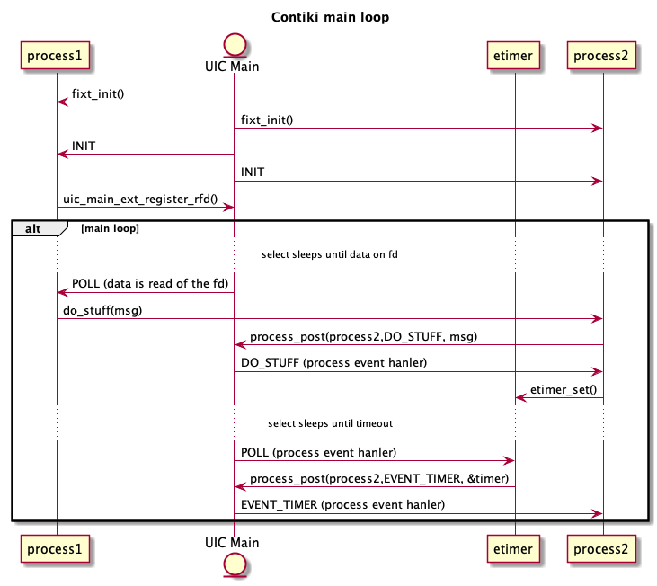

# Unify SDK Library Developer Guide

This guide is targeted for new Unify application developers who intend to use the libuic library.
It also provides a quick-start guide to make a Unify application using the Unify shared library (C).

## Creating a New Application

1. Create a new folder in `applications` folder e.g., `applications/my_uic_application`.
2. Create a main function within the `applications/my_uic_application` folder.

    The following is an example of a the bare minimum main.c file to get started.
    A more comprehensive demo is located in `applications/demo_uic_lib`,
    where some of the shared Unify libraries are demonstrated as well, including MQTT client, logging, and the configuration system.

        #include "uic_main.h"
        #include "process.h"

        // Demo process definition
        PROCESS(my_uic_application_process, "My Unify Application Process");

        // Demo process implementation
        PROCESS_THREAD(my_uic_application_process, ev, data)
        {
          PROCESS_BEGIN()
          while (1) {
            switch (ev) {
              case PROCESS_EVENT_INIT:
                // Add Init code here
                break;
              case PROCESS_EVENT_EXIT:
                // Add Exit code here
                break;
            }
            PROCESS_WAIT_EVENT();
          }
          PROCESS_END()
        }

        // Setup fixture, called on start-up
        sl_status_t my_uic_application_setup(void)
        {
          // Start the demo process
          process_start(&my_uic_application_process, NULL);
          return SL_STATUS_OK;
        }

        int main(int argc, char **argv)
        {
          // Setup fixtures
          uic_fixt_setup_step_t uic_fixt_setup_steps_list[]
            = {{my_uic_application_setup, "My Unify Application"}, {NULL, "Terminator"}};

          // Shutdown fixtures
          uic_fixt_shutdown_step_t uic_fixt_shutdown_steps_list[]
            = {{NULL, "Terminator"}};

          // Run uic_main and return result
          return uic_main(uic_fixt_setup_steps_list,
                          uic_fixt_shutdown_steps_list,
                          argc,
                          argv,
                          "1.0" /* My application version */);
        }

3. Hook `my_uic_application` into the Build System.

    After adding the main function to a `main.c` file under `applications/my_uic_application`, modify the cmake 
    configuration file to include `my_uic_application` in the build by adding `add_subdirectory(my_uic_application)` to `applications/CMakeLists.txt`

        add_executable(my_uic_application main.c)
        target_link_libraries(my_uic_application uic)
        # Include my_uic_application in binary package
        install(TARGETS my_uic_application RUNTIME DESTINATION bin)

    

4. Compile

    Now, everything should be set up to compile my_uic_application as part of the
    Unify build. To cross compile the application for Raspberry Pi, run
    following commands in the root of source folder:
    > NB: Prerequisite is to have the Unify docker image (see
    > [Docker](../docker/readme_developer.md))

        docker run -it --rm  -v`pwd`:`pwd` -w `pwd` uic_armhf
        mkdir build
        cd build
        cmake -GNinja -DCMAKE_TOOLCHAIN_FILE=../cmake/armhf_debian.cmake ..
        ninja
        ninja deb

## Unify SDK Library (Unify Main) and IPC

The Unify SDK library is implemented as an event-driven system.
It runs in a single thread and uses the proto-threads from the Contiki OS as an event queue system.
The event system is centered around a single select call, which monitors all external file descriptors and is responsible for triggering a timer, which is implemented in the Unify Main component.
This design was chosen to avoid concurrency issues between threads.

The following sequence diagram shows how the Unify Main loop triggers events based on file descriptors in `process1` and timers in `process2`.

Additional information on this is available in the Unify Library doxygen.
